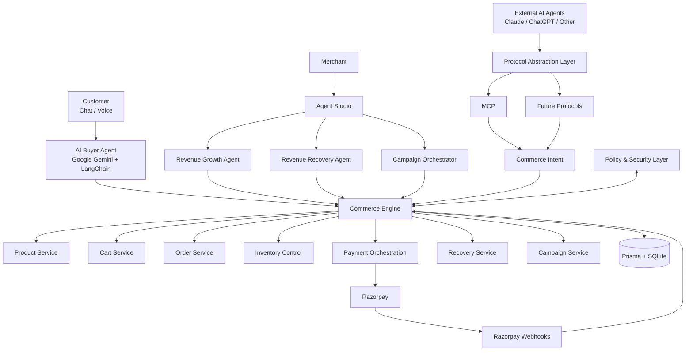

<div align="center">

# Linnéa

### AI-Native Agentic Commerce & Revenue Growth Platform

**Different AI interfaces. One commerce engine. Real revenue.**


</div>

---

## 0. Table of Contents

1. [Overview](#1-overview)
2. [Key Metrics at a Glance](#2-key-metrics-at-a-glance)
3. [Core Modules](#3-core-modules)
4. [System Architecture](#4-system-architecture)
5. [Technology Stack](#5-technology-stack)
6. [Data Model Summary](#6-data-model-summary)
7. [Getting Started](#7-getting-started)
8. [Environment Configuration](#8-environment-configuration)
9. [Available Scripts](#9-available-scripts)
10. [Agent Commerce Protocol (MCP) Integration](#10-agent-commerce-protocol-mcp-integration)
11. [Payments & Webhook Reconciliation](#11-payments--webhook-reconciliation)
12. [Application Routes](#12-application-routes)
13. [Security & Policy Enforcement](#13-security--policy-enforcement)
14. [Testing](#14-testing)

---

## 1. Overview

Linnéa unifies four traditionally separate commerce disciplines — customer experience, merchant analytics, marketing automation, and payment infrastructure — into a single **AI-driven Commerce Engine**.

Customers shop conversationally (text or voice); merchants operate specialized revenue agents; and external AI systems (Claude, ChatGPT, or any MCP-compatible agent) can browse the catalog and transact directly through a protocol abstraction layer.

**Guiding principle:**
> AI handles reasoning. The Commerce Engine handles deterministic commerce operations.

---

## 2. Key Metrics at a Glance

| # | Metric | Value |
|---|--------|-------|
| 1 | Core commerce agents shipped | **4** (Shopping, Revenue Growth, Recovery, Campaigns) |
| 2 | Supported AI commerce protocols | **1 active** (MCP) / 3 planned (ACP, AP2, x402/UAP) |
| 3 | Database models | **19** Prisma models |
| 4 | Order lifecycle states tracked | **3** payment states × **3** fulfillment states |
| 5 | Payment reconciliation paths | **2** (`payment_link.paid`, `payment.captured`) |
| 6 | Notification/delivery channels | **3** (Email, SMS, WhatsApp-ready) |
| 7 | Distinct MCP tools exposed to AI buyers | **8** |
| 8 | Top-level app route groups | **2** (`/shop`, `/dashboard`) |

---

## 3. Core Modules

| # | Module | Description | Primary Route |
|---|--------|-------------|----------------|
| 1 | **AI Shopping Agent** | Conversational + voice product discovery, cart building, and checkout for customers | `/shop` |
| 2 | **Revenue Growth Agent** | Merchant-facing conversational analytics and opportunity surfacing | `/dashboard/agents/revenue` |
| 3 | **Revenue Recovery Agent** | Detects failed payments & abandoned carts, generates recovery payment links | `/dashboard/agents/recovery` |
| 4 | **Campaign Orchestrator** | Converts natural-language campaign briefs into targeted, data-backed messaging | `/dashboard/agents/campaigns` |
| 5 | **AI Buyer (MCP) Interface** | Lets external AI agents (e.g., Claude Desktop) search, cart, and check out autonomously | `/dashboard/agents/mcp` |
| 6 | **Storefront** | Traditional browsable catalog with filters, sort, and AI-picked recommendations | `/shop/home` |

---

## 4. System Architecture



**5 architectural layers**, top to bottom:

1. **Interface layer** — chat/voice UI, merchant dashboards, external AI agents
2. **Protocol abstraction layer** — normalizes MCP (and future ACP/AP2/x402/UAP) requests into a single intent format
3. **Security & policy layer** — validates every intent against a trusted context before execution
4. **Commerce Engine** — the single authoritative surface for products, carts, orders, inventory, payments, recovery, and campaigns
5. **Persistence & payments** — Prisma/SQLite plus Razorpay orchestration with webhook-based reconciliation

---

## 5. Technology Stack

| # | Layer | Technology | Version |
|---|-------|------------|---------|
| 1 | Framework | Next.js (App Router) | 16.3.4 |
| 2 | UI Library | React | 19.2.8 |
| 3 | Language | TypeScript | 5.x |
| 4 | Styling | Tailwind CSS | 4.x |
| 5 | ORM | Prisma | 6.19.3 |
| 6 | Database | SQLite | — |
| 7 | AI Orchestration | LangChain + LangChain Core | 1.5.10 / 1.2.9 |
| 8 | LLM Provider | Google Gemini (`@langchain/google-genai`) | 2.3.0 |
| 9 | Agent Protocol | Model Context Protocol SDK | 1.30.0 |
| 10 | Payments | Razorpay (Test Mode) | 2.9.8 |
| 11 | Email | Resend | 6.26.0 |
| 12 | SMS | Twilio | 6.1.0 |
| 13 | Auth | `jose` (JWT sessions) + `bcryptjs` | 6.2.10 / 3.0.3 |
| 14 | Validation | Zod | 4.5.4 |
| 15 | Icons | lucide-react | 1.40.0 |

---

## 6. Data Model Summary

The schema (`prisma/schema.prisma`) defines **19 models** grouped into **5 domains**:

| # | Domain | Models |
|---|--------|--------|
| 1 | Identity | `User`, `Merchant`, `CustomerProfile`, `MerchantCustomer` |
| 2 | Conversational AI | `Conversation`, `Message`, `AgentRun`, `AgentAction` |
| 3 | Catalog & Cart | `Product`, `Cart`, `CartItem` |
| 4 | Orders & Payments | `Order`, `OrderItem`, `Payment`, `PaymentLink`, `SavedPaymentMethod`, `WebhookEvent` |
| 5 | Growth | `RecoveryAttempt`, `Campaign`, `CampaignDelivery` |

Order records track **2 independent status axes**:
- `status`: `PENDING → PAID → CANCELLED`
- `fulfillmentStatus`: `PENDING → FULFILLED` (or `REQUIRES_RECONCILIATION` on inventory shortfall)

---

## 7. Getting Started

Follow these **6 steps** to run Linnéa locally:

1. **Clone and install dependencies**
   ```bash
   git clone <repository-url>
   cd linnea
   npm install
   ```

2. **Configure environment variables** — copy `.env.example` (if present) to `.env` and populate the values described in [Section 8](#8-environment-configuration).

3. **Provision the database**
   ```bash
   npx prisma migrate dev
   ```

4. **Seed demo data** (merchant, customer, catalog, sample orders)
   ```bash
   npx tsx prisma/seed.ts
   npx tsx scripts/seed-catalog.ts
   ```

5. **Run the development server**
   ```bash
   npm run dev
   ```

6. **Sign in with demo credentials**

   | # | Role | Email | Password |
   |---|------|-------|----------|
   | 1 | Merchant | `merchant@example.com` | `DemoMerchant123!` |
   | 2 | Customer | `customer@example.com` | `DemoCustomer123!` |

Application will be available at `http://localhost:3000`.

---

## 8. Environment Configuration

| # | Variable | Purpose | Required |
|---|----------|---------|----------|
| 1 | `DATABASE_URL` | SQLite connection string | ✅ |
| 2 | `RAZORPAY_KEY_ID` | Razorpay Test Mode public key | ✅ |
| 3 | `RAZORPAY_KEY_SECRET` | Razorpay Test Mode secret key | ✅ |
| 4 | `RAZORPAY_WEBHOOK_SECRET` | HMAC secret for webhook signature verification | ✅ |
| 5 | `GOOGLE_API_KEY` | Gemini model access for shopping/revenue agents | ✅ |
| 6 | `RESEND_API_KEY` | Email delivery for campaigns | Optional |
| 7 | `TWILIO_ACCOUNT_SID` / `TWILIO_AUTH_TOKEN` / `TWILIO_PHONE_NUMBER` | SMS delivery for campaigns | Optional |
| 8 | `MCP_MERCHANT_ID` | Merchant context bound to the MCP server | ✅ (for MCP) |
| 9 | `MCP_AI_BUYER_EMAIL` | Identity used for AI-buyer-originated orders | Optional |

> Run `npx tsx scripts/diagnostic.ts` to verify Razorpay key configuration at any time.

---

## 9. Available Scripts

| # | Command | Description |
|---|---------|-------------|
| 1 | `npm run dev` | Start the development server |
| 2 | `npm run build` | Build for production |
| 3 | `npm run start` | Start the production server |
| 4 | `npm run lint` | Run ESLint |
| 5 | `npx tsx scripts/seed-catalog.ts` | Seed/refresh the product catalog |
| 6 | `npx tsx scripts/mcp-server.ts` | Launch the standalone MCP server for external AI agents |
| 7 | `npx tsx scripts/test-agent.ts` | Smoke-test the customer shopping agent |
| 8 | `npx tsx scripts/test-merchant-agent.ts` | Smoke-test the revenue growth agent |
| 9 | `npx tsx scripts/test-recovery.ts` | Integration test for the recovery workflow |
| 10 | `npx tsx scripts/test-protocol.ts` | Validate MCP request normalization and policy enforcement |
| 11 | `npx tsx scripts/test-mcp-e2e.ts` | Full end-to-end MCP client test (search → cart → order → checkout → status) |
| 12 | `npx tsx scripts/diagnostic.ts` | Verify Razorpay key configuration |

---

## 10. Agent Commerce Protocol (MCP) Integration

Linnéa exposes **8 MCP tools** so external AI agents can transact against a merchant's live catalog:

| # | Tool | Purpose |
|---|------|---------|
| 1 | `search_products` | Query the catalog by keyword, category, or price range |
| 2 | `get_product` | Retrieve full detail for a single product |
| 3 | `get_cart` | Read the AI buyer's current cart state |
| 4 | `add_to_cart` | Add a product/quantity to the cart |
| 5 | `create_cart` | Reset/initialize the cart |
| 6 | `create_order` | Convert the active cart into an authoritative order |
| 7 | `generate_checkout_link` | Produce a Razorpay Test Mode payment link for an order |
| 8 | `get_payment_status` | Poll the authoritative payment status of an order |

**3 layers of protection** wrap every MCP call:
1. `McpProtocolAdapter` strips any client-supplied trust fields (`merchantId`, `pricePaise`, `totalPaise`, etc.) from the raw request.
2. `CommercePolicy.validate()` enforces that every intent carries a valid, server-derived `TrustedCommerceContext`.
3. `CommerceEngine.execute()` is the single choke point through which all normalized intents are fulfilled — no protocol adapter talks to the database directly.

To connect Claude Desktop, see the generated configuration at `/dashboard/agents/mcp`, which renders your merchant-specific `claude_desktop_config.json`.

---

## 11. Payments & Webhook Reconciliation

The webhook handler (`/api/webhooks/razorpay`) processes **2 event types** through a **4-stage pipeline**:

| # | Stage | Behavior |
|---|-------|----------|
| 1 | Signature verification | HMAC-SHA256 against `RAZORPAY_WEBHOOK_SECRET`; rejects on mismatch |
| 2 | Idempotency check | Deduplicates on event ID (fallback: signature) via `WebhookEvent` |
| 3 | Atomic reconciliation | Single transaction: decrements inventory, marks order `PAID`/`FULFILLED`, converts cart, updates payment/payment-link, resolves any active recovery attempt |
| 4 | Inventory-shortfall fallback | If stock is insufficient, the order is **not** marked paid/fulfilled; instead `fulfillmentStatus` is set to `REQUIRES_RECONCILIATION` for manual review |

---

## 12. Application Routes

| # | Area | Route Prefix | Access |
|---|------|---------------|--------|
| 1 | Customer shopping | `/shop` | `CUSTOMER` |
| 2 | Customer storefront | `/shop/home` | `CUSTOMER` |
| 3 | Customer orders | `/shop/orders` | `CUSTOMER` |
| 4 | Customer settings | `/shop/settings` | `CUSTOMER` |
| 5 | Merchant dashboard | `/dashboard` | `MERCHANT` |
| 6 | Agent Studio | `/dashboard/agents` | `MERCHANT` |
| 7 | Products & customers | `/dashboard/products`, `/dashboard/customers` | `MERCHANT` |
| 8 | Payments & links | `/dashboard/payments`, `/dashboard/links` | `MERCHANT` |

Route access is enforced centrally in `src/middleware.ts`, which redirects unauthenticated users to `/login` and cross-role visitors to their correct workspace.

---

## 13. Security & Policy Enforcement

1. **Session-based auth** via signed JWT (`jose`), validated on every server action and route.
2. **Role isolation** — `validateAgentType()` prevents a merchant from invoking customer-agent conversations and vice versa.
3. **Ownership checks** — every conversation, order, and cart lookup verifies `userId` / `merchantId` ownership before returning data.
4. **Trusted-context commerce** — AI-originated actions (MCP or future protocols) can never supply their own pricing, merchant ID, or customer ID; these are always resolved server-side.
5. **Idempotent webhooks** — duplicate payment notifications cannot double-fulfill an order.

---

## 14. Testing

| # | Script | Coverage |
|---|--------|----------|
| 1 | `scripts/test-protocol.ts` | MCP request sanitization + policy validation (malicious payload rejection) |
| 2 | `scripts/test-mcp-e2e.ts` | Full MCP client lifecycle against a live server process |
| 3 | `scripts/test-agent.ts` | Customer shopping agent conversational flow |
| 4 | `scripts/test-merchant-agent.ts` | Revenue growth agent response generation |
| 5 | `scripts/test-recovery.ts` | Recovery opportunity detection, duplicate prevention, provider-failure handling |
